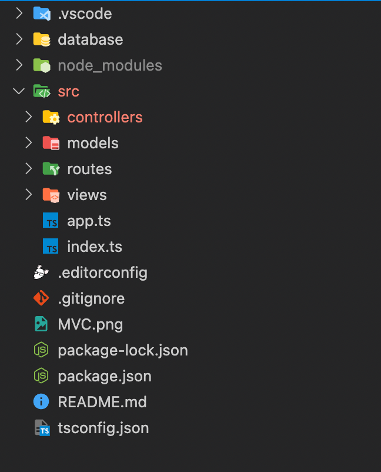

# Prueba 29 August
## Pasos de instalación de servicios
### Instalación de Nodejs
[Instalador Node js](https://nodejs.org/es/download/)

### Inicialización del proyecto
`
npm init --yes
`
### Instalación de frameworks y dependencias
`
npm install express morgan cors jsonwebtoken passport passport-local
`

### Instalación de Cassandra

[Instalación Java 8](https://www.java.com/es/download/ie_manual.jsp)
[Instalación Python 2.7](https://www.python.org/download/releases/2.7/)

`
npm install cassandra-driver
`
### Instalación Dependencias de desarrollo
`
npm install ts-node-dev
`

`
npm i -D @types/cors 
`

`
npm i -D @types/express
`

`
npm i -D @types/morgan
`

`
npm i -D @types/jsonwebtoken
`
## Actividades asignadas por integrante
### Check de actividades realizadas y faltantes
#### Julian 
- [ ] Controladores 
- [X] Creación inicial
- [X] Rutas 
#### Andres
- [ ] Controladores 
- [X] Creación inicial
- [X] Rutas
#### Jerson 
- [X] Modelo
#### Jean
- [X] Middleware
#### Mishell
- [X] Middleware
- [X] Readme

## Diagrama de directorios (MVC)

    - database -> carpeta
		- db.cql
		- execute.cql
	- src -> carpeta
	 	- controllers -> carpeta
			- controller.user.ts
		- models -> carpeta
			-connection.ts
		- routes -> carpeta
			- routes.admin.ts
			- routes.interfaces.ts
			- routes.users.ts
		- app.ts
		- index.ts
	- .editorconfig
	- .gitignore
	- package-lock.json
	- README.md
	- tsconfig.json

## Diagrama de datos NoSQL

